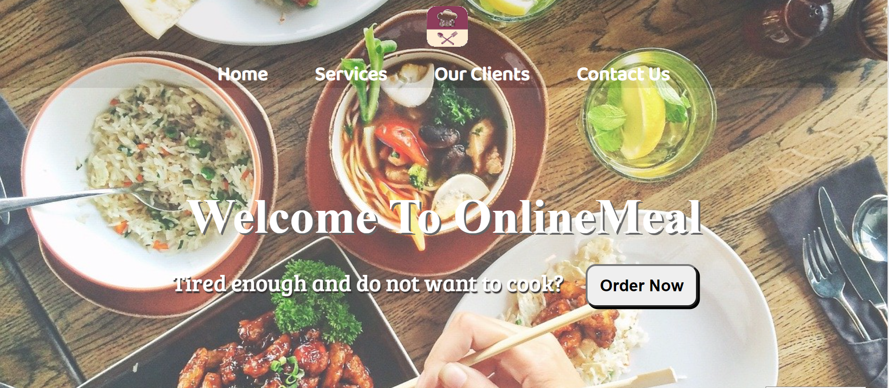

# Hi, I'm Shashi Jaiswal. I have a keen interest in Web Development.  👋

# OnlineMeal

OnlineMeal is an online food ordering and delivering website which provides food catering service too! 

## Acknowledgements

 - [Online Transparent png](https://onlinepngtools.com/create-transparent-png)
 - [YouTube](https://www.youtube.com)
 - [Readme.so](https://readme.so/editor)
 - [OnlineMeal](https://shashijaiswal1.github.io/OnlineMeal.github.io/)

  
## Features

- Fully Responsive
- Optimized for Mobile 
- Easy to Use
- Cross platform
  
## Screenshots

 
## Tech Stack

**Client:** HTML, CSS
  
## 🛠 Skills
Javascript, HTML, CSS...
  
## Lessons Learned

I learned how to make a website responsive and how to write a structured code. I also learned how to create a hamburger menu. Challenges I faced are-
Resizing the backgrounds and pngs.
To fit everything at its place.

## How to Use It ? (Usage)
Follow the steps given below to use it:

Download this repo as zip file or clone it by running the below command

git clone https://github.com/shashijaiswal1/OnlineMeal.github.io.git

Now, open the "OnlineMeal.github.io" folder which got created "after clonning" it in the previous step.

cd OnlineMeal.github.io

Now open index.html file with any of your browser.

## Pull requests welcome!
Spotted an error? Something doesn't make sense? Send me a pull request! Thanks!
